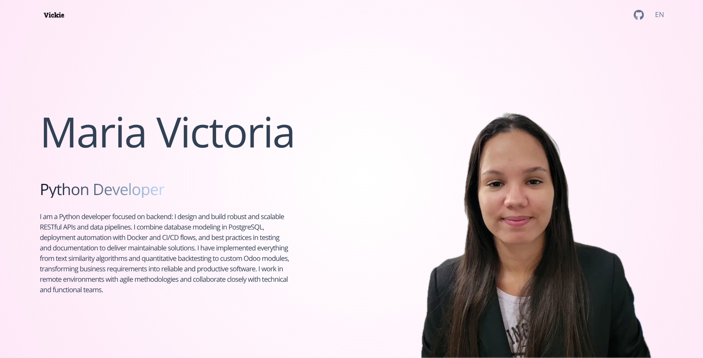

<!-- PROJECT LOGO -->
<br />
<div align="center">
  <a href="https://victoria-portfolio-psi.vercel.app/">
    
  </a>

  <h3 align="center">Vickie Portfolio Template</h3>

  <p align="center">
    An awesome Portfolio template to jumpstart your proffesional projects!
    <br />
    <br />
    <a href="https://victoria-portfolio-psi.vercel.app/">View Demo</a>
    &middot;
  </p>
</div>

<!-- ABOUT THE PROJECT -->
## About The Project



This is a minimalist portfolio template that you can use to create your own portfolio. It is built with React and Vite, and it is fully responsive. You can easily customize it to fit your needs.

Here's why:
* You should use this template to create your own portfolio and showcase your work.
* You should use this, and dont start building your portfolio from scratch.

Of course, no one template will serve all projects since your needs may be different. So I'll be adding more in the near future. You may also suggest changes by forking this repo and creating a pull request or opening an issue. 

## Getting Started

This is an example of how you may give instructions on setting up your project locally.
To get a local copy up and running follow these simple example steps.

### Prerequisites

This is an example of how to list things you need to use the software and how to install them.
* npm
  ```sh
  npm install npm@latest -g
  ```

### Installation

_Below is an example of how you can instruct your audience on installing and setting up your app. This template doesn't rely on any external dependencies or services._

1. Clone the repo
   ```sh
   git clone https://github.com/vickie333/victoria-portfolio.git
   ```
2. Install NPM packages
   ```sh
   npm install
   ```
3. Enter your API of Youtube and Channel ID in your .env file
   
4. Run the app
   ```sh
   npm run dev
   ```

<!-- USAGE EXAMPLES -->
## Usage

This is a portfolio template, you can use it to create your own portfolio.

<!-- CONTRIBUTING -->
## Contributing

Contributions are what make the open source community such an amazing place to learn, inspire, and create. Any contributions you make are **greatly appreciated**.

If you have a suggestion that would make this better, please fork the repo and create a pull request. You can also simply open an issue with the tag "enhancement".
Don't forget to give the project a star! Thanks again!

1. Fork the Project
2. Create your Feature Branch (`git checkout -b feature/AmazingFeature`)
3. Commit your Changes (`git commit -m 'Add some AmazingFeature'`)
4. Push to the Branch (`git push origin feature/AmazingFeature`)
5. Open a Pull Request

<!-- LICENSE -->
## License

See `LICENSE.txt` for more information.


<!-- CONTACT -->
## Contact

Maria Victoria  mariavictoriaperezcontreras@gmail.com

Project Link: https://victoria-portfolio-psi.vercel.app/

